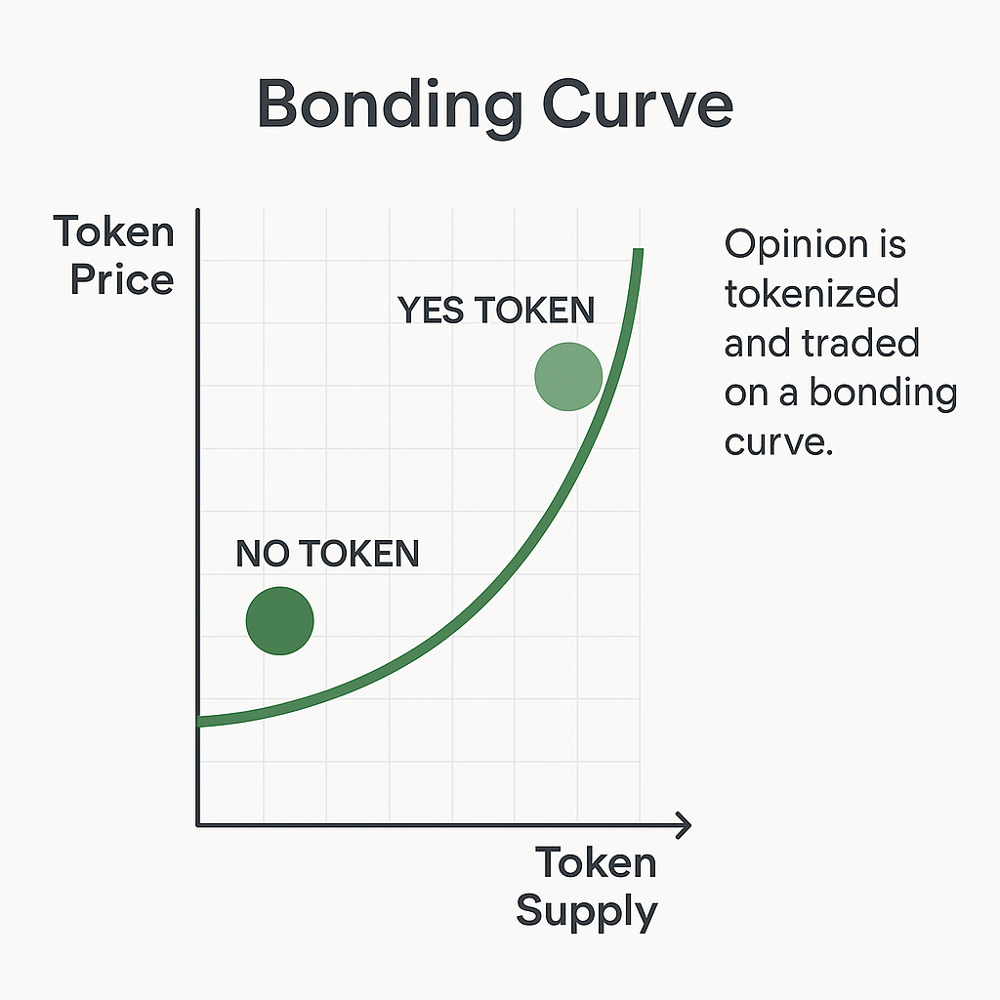

# 🎯 Solana Prediction Market(NOYEAH)

A decentralized prediction market dApp built on the Solana blockchain. Users can participate in prediction contests by staking SOL and selecting an outcome. Winners are rewarded based on a bonding curve pricing model and correct predictions.

---

# 🚀 BETA Version Live on Solana Devnet
2S2ztAYPLzQN3McM2jJqNhoycahBMpyEc1tvNLBdR2qv

Signature: 5Z4maZyXe8EC8o878PPgUNagA7o8Co2PPM3aRmP1QYu5P7HyZfefpjkuHF5NjLiBAYmsvHGx7eMpoNau5VL2Ksvz

## 🚀 Features

- 📈 Bonding curve pricing (dynamic price based on total participation)
- 🧠 YES/NO choice prediction contests
- 🎯 Verifiable contest resolution via admin or oracle
- 💰 Winner payout based on correct prediction
- 🔐 Built using Anchor framework

---

## 🛠 Tech Stack

- **Solana** – Blockchain platform
- **Anchor** – Framework for Solana smart contracts
- **Rust** – Smart contract programming language
- **TypeScript + Nextjs** *(optional)* – Frontend for interacting with the contract

---

## 📦 Smart Contract Overview

### Accounts

- `Contest`
  - `id`: unique ID for the contest
  - `question`: the prediction question
  - `options`: available choices
  - `total_stake`: total SOL staked
  - `status`: open, resolved
  - `correct_option`: set after contest resolution

- `UserParticipation`
  - `user`: user's wallet
  - `contest_id`: ID of the contest
  - `selected_option`: user’s chosen answer
  - `amount`: amount staked

---

## 📉 Bonding Curve Pricing

Dynamic pricing is used to calculate the stake amount using a simple bonding curve formula:

## Contract Repository
https://github.com/priyanshu07222/noyeah-contract